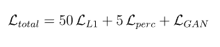
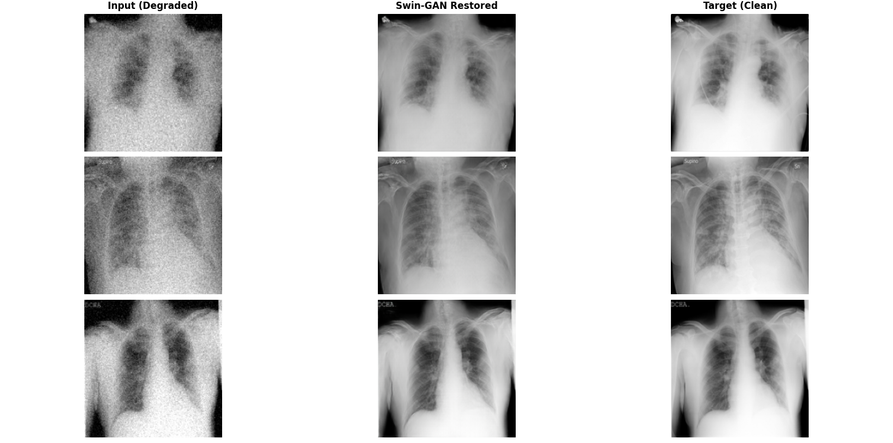

# 🧠 Medi_Swin  
### Degradation-Aware Medical Image Restoration using Swin Transformer + GAN


---

## 📌 Overview

**Medi_Swin** is a **hybrid Swin Transformer + GAN-based framework** designed to restore degraded chest X-ray images while preserving clinically critical details.

Unlike traditional CNN models, this system:

- Learns **global + local dependencies** using Swin Transformer  
- Uses **GAN training** for perceptual realism  
- Applies **dynamic degradation simulation** for real-world robustness  

🎯 **Goal:** Restore X-rays **without hallucination artifacts**, ensuring diagnostic reliability.

---

## 🚀 Key Highlights

- 🧠 **Swin Transformer Backbone (timm)**
- 🧩 **U-Net Style Encoder-Decoder with Skip Connections**
- ⚙️ **Degradation-Aware Training Pipeline**
- 🎭 **GAN Framework (Generator + PatchGAN Discriminator)**
- 🔬 **Medical Texture Preservation via Perceptual Loss**
- 🔄 **End-to-End Restoration Pipeline**

---

## 🏗️ Architecture

### 🔹 Generator: MediSwin

- Backbone: `swin_tiny_patch4_window7_224` (pretrained)
- Decoder: Multi-stage upsampling with skip connections
- Output: Restored high-quality X-ray

✔ Combines **Transformer + CNN decoding power**

---

### 🔹 Discriminator: PatchGAN

- Uses **Spectral Normalization**
- Operates on image patches for fine realism
- Stabilizes GAN training

---

## ⚙️ Degradation Pipeline

### 🔥 Training-Time Degradation (Dynamic)

- Gaussian Blur (80% probability)
- Noise Injection (σ ≈ 15)
- Downscaling (0.4x – 0.6x)

➡️ Enables robustness to real-world corrupted scans

---

## 📂 Dataset

- **Name:** COVID-19 Radiography Database  
- **Source:** [](https://www.kaggle.com/datasets/tawsifurrahman/covid19-radiography-database)
- **Type:** Grayscale Chest X-rays  (only Covid and Normal lungs)
- **Total** : 13,808 images

---

## 🧪 Training Strategy: Learning Rate Strategy (TTUR)

Uses **TTUR (Two-Time Scale Update Rule)** for stable GAN training:  
➡️ **Generator learns faster**, **Discriminator slower** → avoids collapse  

---

#### 🟢 Phase 1: Baseline Learning (Epochs 1–20)
* **LR_G:** `2e-4` → `5e-5` (for stability on 4GB VRAM)
* **LR_D:** `5e-5`
* ✔ Learn structure + textures
* ✔ Moderate degradation
* ✔ 50% probability of $5 \times 5$ Gaussian Blur, $\sigma=10$ Noise, and $0.5\text{x}$ to $0.8\text{x}$ Scaling.

---

#### 🟡 Phase 2: Stress Testing & Noise (Epochs 21–30)
* **LR_G:** `5e-5` (4x slower than initial)
* **LR_D:** `1e-5` (5x slower than initial)
* ✔ Lower LR to stabilize and "settle" weights after Epoch 19 spikes
* ✔ 80% probability of $7 \times 7$ Gaussian Blur, $\sigma=15$ Noise, and $0.4\text{x}$ to $0.6\text{x}$ Scaling.

---

#### 🔴 Phase 3: High-Precision Refinement (Epochs 31–40)
* **LR_G:** `2e-5`
* **LR_D:** `5e-6`
* ✔ Prevents overfitting and keeps the Discriminator from becoming too aggressive
* ✔ 90% probability of $9 \times 9$ Gaussian Blur, $\sigma=20$ Noise, and $0.2\text{x}$ to $0.4\text{x}$ Scaling without gradient crashing.

---

## ⏱️ Training Configuration

| Parameter | Value |
|----------|------|
| Epochs | 40 |
| Batch Size | 4 |
| Image Size | 224 |
| LR (Generator) | 5e-5 |
| LR (Discriminator) | 1e-5 |

---

## 💻 System Used

- CPU: Intel Xeon W-2175  
- RAM: 64 GB  
- GPU: NVIDIA Quadro P1000 (4GB)  
- Storage: 1.8 TB  

⚠️ Optimized for **CUDA GPUs (T4 / A100 recommended)**

---

## 📉 Loss Functions

### 🔹 Hybrid Loss Design

- **L1 Loss (×50)** → Pixel accuracy  
- **Perceptual Loss (×5)** → Texture realism (VGG16)  
- **GAN Loss (BCEWithLogits + Soft Labels)** → Adversarial training  

✔ Ensures both **numerical + visual fidelity**



---

## 📊 Results

| Mode | PSNR | SSIM |
|-----|------|------|
| 🟢 Baseline Performance| 44.54 dB | 0.9934 |
| 🟡 Stress-Test Performance | 30.75 dB | 0.9038 |
| 🔴 High-Precision Refinement | 31.61 dB | 0.9089 |

---


## 🖼️ Visual Results
Epoch 30


Epoch 40

### ✨ Observations
- Removes **heavy noise & blur**
- Preserves **fine anatomical details**
- No hallucinated artifacts
- Maintains diagnostic integrity

---

## 📁 Project Structure
``` id="structure-block"
Medi_Swin/
│── arch/                              # Generator + Discriminator
│ ├── generator.py
│ ├── discriminator.py
│── data/                              # COVID / Normal images
│ ├── raw/
│ |────COVID
| |────Normal
│── dataset/                           # Dataset loader
│ └── xray_dataset.py
├── checkpoints                        # Saved models
│── utils/                             # Losses, metrics, degradation
│ ├── degradation.py
│ ├── losses.py
│ ├── metrics.py
├── results                           # Outputs
│── config.py
│── train.py
│── test.py
│── unseen.py
│── visualize.py
│── requirements.txt
```

---

## 📦 Requirements

```txt id="requirements-block"
torch>=2.0
torchvision>=0.15
timm>=0.9
opencv-python
numpy
matplotlib
pillow
pandas
scikit-image
```

---

## 🛠️ Installation

```bash
git clone https://github.com/your-username/Medi_Swin.git
cd Medi_Swin
# Create environment
conda create -n mediswin python=3.10
conda activate mediswin
pip install -r requirements.txt
```
## 🚜Train
```bash
# Run on terminal
python train.py           # FOR TRAINING
python visualize.py       # For Visualization
python unseen.py          # For Testing        
```
---

## ⚡ Key Strengths
- Transformer-based global understanding  
- GAN-based realism  
- Medical texture preservation  
- Robust under extreme corruption  

---

## 🔮 Future Work
MRI / CT support • Real-time inference • Web deployment  

---
## License
This project is licensed under the MIT License - see the [LICENSE](LICENSE) file for details.
